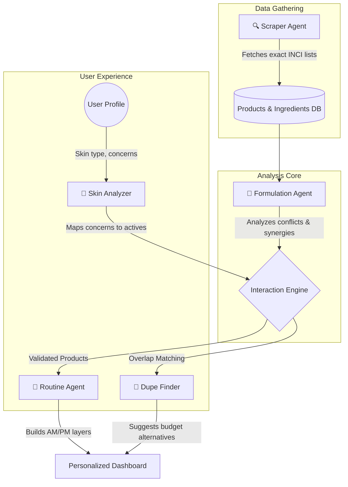

# 🌸 SakuraSkin

**SakuraSkin** is an AI-powered, multi-agent skincare recommender system designed to act as your personal cosmetic chemist and dermatologist. 

Instead of generic product recommendations, SakuraSkin uses a coordinated team of intelligent agents to analyze ingredient lists (INCI), cross-reference interactions, flag potential irritants, and build perfect AM/PM routines tailored to your unique skin profile.

## 🌟 Multi-Agent Workflow

Our system utilizes five specialized AI agents that work together to process data and generate personalized recommendations.



### Meet the Agents
1. **🧪 Formulation Agent**: Acts as your personal cosmetic chemist. Parses INCI lists and cross-references ingredient interactions, flagging conflicts (e.g., Retinol + AHA) and highlighting synergies (e.g., Vitamin C + Vitamin E).
2. **🔍 Scraper Agent**: Searches the web for current product listings, fetching the exact INCI ingredient lists from popular brands to keep the database updated.
3. **🧠 Skin Analyzer**: Analyzes your unique skin profile — type, concerns, allergies — and maps them to the perfect active ingredients and products.
4. **🧴 Routine Agent**: Builds and validates AM/PM skincare routines. Ensures smart ordering, detects conflicts between selected products, and warns of missing steps (like missing sunscreen in the AM).
5. **💸 Dupe Finder**: Compares ingredient overlap between expensive and budget products to find affordable alternatives with the same active benefits.

## ✨ Features
- **Interactive Skin Quiz**: Get matched with ingredients you should seek and ones you should avoid.
- **Product Explorer**: Browse 45+ curated skincare products with Safety Scores.
- **Ingredient Encyclopedia**: Deep dive into 40+ ingredients, complete with typical concentrations, pH levels, and a compatibility checker.
- **Side-by-Side Comparison**: Compare up to 4 products at once to see shared ingredients, unique benefits, and potential conflicts.
- **AM/PM Routine Builder**: Drag and drop products into a routine and get an instant safety and compatibility score.
- **Daily Skin Diary**: Track your skin's progress over time with a visual trend chart.

## 🛠️ Tech Stack
- **Frontend**: Vanilla JS (SPA Router), Vite, TailwindCSS v4 (CSS-first config), Chart.js
- **Backend**: Python, FastAPI, Uvicorn
- **Data**: JSON-based local knowledge graphs for fast multi-agent querying

## 🚀 Running Locally

### Prerequisites
- Python 3.12+
- Node.js LTS

### Setup

1. **Backend Setup**
```bash
cd backend
pip install -r requirements.txt
uvicorn main:app --reload --port 8000
```

2. **Frontend Setup**
```bash
cd frontend
npm install
npm run dev
```

The app will be running at `http://localhost:5173`.

---
*Made with 🌸 by the SakuraSkin Team.*
